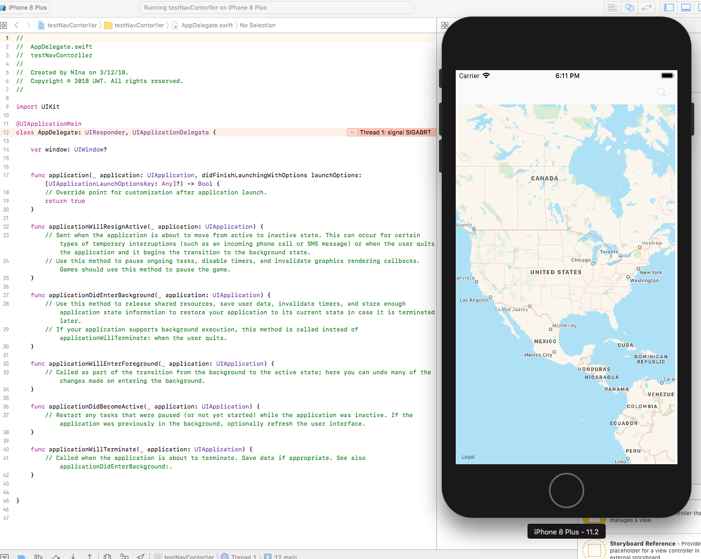

# Lab05_504Code
See Below for code used to develop apps. 
## Part 1. Simple Map App Showing User Location With Custom Text, Subtext, and zoom.

Discussion: I worked off of one of the macbooks for this lab. I was able to create recreate some of the functionality demonstrated in the class room while adding some additional code snippets. I found this video as a great <a href="https://youtu.be/wU1XN-Gk1LM" > reference :</a>
```
ViewController.swift
SimpleMapApp

Created by Patrick on 3/11/18.
Copyright © 2018 UWT. All rights reserved.

import UIKit
import MapKit
import CoreLocation
class ViewController: UIViewController, MKMapViewDelegate {

    @IBOutlet weak var SimpleMap: MKMapView!
    
    let locationManager = CLLocationManager()
    
    override func viewDidLoad() {
        super.viewDidLoad()
      
        
        //Create Location for app to begin with
        var location = CLLocationCoordinate2DMake(
            44.827745,
            -92.943822)
        
    //Code block here establishes initial zoom of map app
        //Creates the level of zoom. Lower numbers increase zoom level (i.e. .00002)
        var span = MKCoordinateSpanMake(0.02, 0.02)
        //Defines the regional view, uses parameters previously established
        var region = MKCoordinateRegion(center: location, span: span)
        //sets region to the initial map app created
        SimpleMap.setRegion(region, animated: true)
        
    //Annnotation Variable and associated settings
        var annotation = MKPointAnnotation()
        //Calls previous variable containg location information
        annotation.coordinate = location
        //Established the dipslayed text
        annotation.title = "Cottage Grove, Mn"
        //Creates a subtitle text
        annotation.subtitle = "My Hometown"
        //Adds annotations to the map
        SimpleMap.addAnnotation(annotation)
    }

    override func didReceiveMemoryWarning() {
        super.didReceiveMemoryWarning()
        // Dispose of any resources that can be recreated.
    }
```
Here a snap shot of the app: 
</img>

## Part II. Adding more functionality: Search Bar, Automatic Zoom and Annotation Creation
```
//  ViewController.swift
//  testNavContorller
//
//  Created by Patrick on 3/12/18.
//  Copyright © 2018 UWT. All rights reserved.
//

import UIKit
import MapKit


class ViewController: UIViewController, UISearchBarDelegate{
    
    
    @IBOutlet weak var MyMapView: MKMapView!
    @IBAction func SearchButton(_ sender: Any) {
        
        let searchController = UISearchController(searchResultsController: nil)
        searchController.searchBar.delegate = self
        present(searchController, animated: true, completion: nil)
    }
    func searchBarSearchButtonClicked(_ searchBar: UISearchBar)
    {
        //Ignore user
        UIApplication.shared.beginIgnoringInteractionEvents()
        
        //Activity Indeicator
        let activityIndicator = UIActivityIndicatorView()
        activityIndicator.activityIndicatorViewStyle = UIActivityIndicatorViewStyle.gray
        activityIndicator.center = self.view.center
        activityIndicator.hidesWhenStopped = true
        activityIndicator.startAnimating()
        
        self.view.addSubview(activityIndicator)
        //Hide Search bar
        searchBar.resignFirstResponder()
        dismiss(animated: true, completion: nil)
        
        //Create Search Request
        let searchRequest = MKLocalSearchRequest()
        searchRequest.naturalLanguageQuery = searchBar.text
        
        let activeSearch = MKLocalSearch(request: searchRequest)
        activeSearch.start {(response, error) in
            activityIndicator.stopAnimating()
            UIApplication.shared.endIgnoringInteractionEvents()
            
            
            if response == nil
            {
                print("Error")
            }
            else
            {
                //Remove annotations
                let annotations = self.MyMapView.annotations
                self.MyMapView.removeAnnotations(annotations)
                
                //Getting Data
                let latitude = response?.boundingRegion.center.latitude
                let longitude = response?.boundingRegion.center.longitude
                
                //create annotation
                let annotation = MKPointAnnotation()
                annotation.title = searchBar.text
                annotation.coordinate = CLLocationCoordinate2DMake(latitude!, longitude!)
                self.MyMapView.addAnnotation(annotation)
                
                // Zoom in on annotations
                let coordinate:CLLocationCoordinate2D = CLLocationCoordinate2DMake(latitude!, longitude!)
                let span = MKCoordinateSpanMake(0.1,0.1)
                let region = MKCoordinateRegionMake(coordinate, span)
                self.MyMapView.setRegion(region, animated: true)
                
            }
        }
    }
    
    override func viewDidLoad() {
        super.viewDidLoad()
        // Do any additional setup after loading the view, typically from a nib.
    }

    override func didReceiveMemoryWarning() {
        super.didReceiveMemoryWarning()
        // Dispose of any resources that can be recreated.
    }


}
```
Here is a snapshot:
</img>
